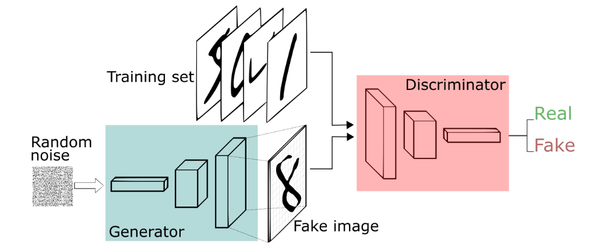
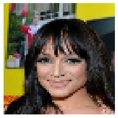
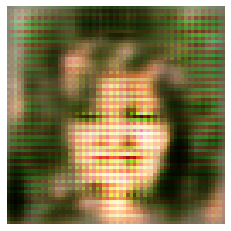
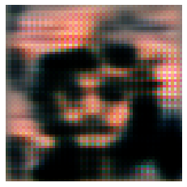

# Face generation using GAN

Generative Adversarial Networks (GANs) are algorithmic architectures that use two neural networks, pitting one against the other (thus the “adversarial”) in order to generate new, synthetic instances of data that can pass for real data. They are used widely in image generation, video generation and voice generation.

GANs were introduced in a paper by Ian Goodfellow and other researchers at the University of Montreal, including Yoshua Bengio, in 2014. Referring to GANs, Facebook’s AI research director Yann LeCun called adversarial training “the most interesting idea in the last 10 years in ML.”

GANs’ potential for both good and evil is huge, because they can learn to mimic any distribution of data. That is, GANs can be taught to create worlds eerily similar to our own in any domain: images, music, speech, prose. They are robot artists in a sense, and their output is impressive – poignant even. But they can also be used to generate fake media content, and are the technology underpinning Deepfakes.

## How GANs Work?

One neural network, called the generator, generates new data instances, while the other, the discriminator, evaluates them for authenticity; i.e. the discriminator decides whether each instance of data that it reviews belongs to the actual training dataset or not.

Meanwhile, the generator is creating new, synthetic images that it passes to the discriminator. It does so in the hopes that they, too, will be deemed authentic, even though they are fake. The goal of the generator is to generate passable hand-written digits: to lie without being caught. The goal of the discriminator is to identify images coming from the generator as fake.

## Steps a GAN takes:

- The generator takes in random numbers and returns an image.
- This generated image is fed into the discriminator alongside a stream of images taken from the actual, ground-truth dataset.
- The discriminator takes in both real and fake images and returns probabilities, a number between 0 and 1, with 1 representing a prediction of authenticity and 0 representing fake.

**So you have a double feedback loop:**

- The discriminator is in a feedback loop with the ground truth of the images, which we know.
- The generator is in a feedback loop with the discriminator.

Both nets are trying to optimize a different and opposing objective function, or loss function, in a zero-zum game. This is essentially an actor-critic model. As the discriminator changes its behavior, so does the generator, and vice versa. Their losses push against each other.

## Data

To generate images using GAN, I used images obtained from **CelebFaces Attributes Dataset (CelebA)** which is a large-scale face attributes dataset with more than 200K celebrity images, each with 40 attribute annotations. The images in this dataset cover large pose variations and background clutter. CelebA has large diversities, large quantities, and rich annotations, including:
- 10,177 number of identities,
- 202,599 number of face images, and
- 5 landmark locations, 40 binary attributes annotations per image.

> Ref: https://mmlab.ie.cuhk.edu.hk/projects/CelebA.html

**Random Face from the dataset**

## Results

**Generated Face 1**

**Generated Face 2**

